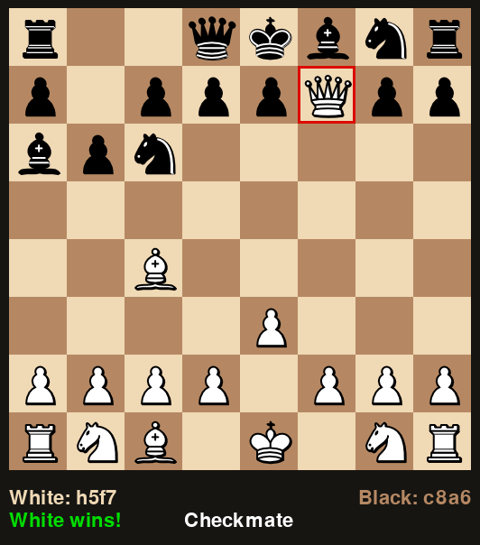

# 0. Requirements

In order to run our program, the following libraries must be installed:

 ```bash
 pip install python-chess
 pip install pygame
 ````


# 1. Chess AI

The methods which make up our Chess AI are  located in the `/ChessHelpers/` 
directory:

## 1.1 Move Generation

We have defined a "move generator" simply as any function which accepts a `chess.Board` 
and returns a `chess.Move`. The goal of this project then is to use AI to create an 
intelligent move generator. The file `ChessEngineHelper.py` contains our move generation 
methods:

1. `random_move` A function which generates a random move from the list of available
legal moves.
2. `greedy_next_best_move` uses a heuristic to generate the current best move without
looking ahead.
3. `mini_max_easy` uses a heuristic to generate the current best move by looking ahead
to the opponents next move.
4. `mini_max_move` is our finished Minimax algorithm which can search to any specified
depth and which has been modified to utilize Alpha Beta pruning and intelligent move
ordering.<br><br>
   
## 1.2 Heuristics

All of our move generation methods (except `random_move`) require the use of a heuristic
to score leaf nodes or board positions. The file `ChessHeuristics.py` contains our board 
evalulation heuristics:

1. `heuristic_1` generates a score for a position based on the value of the pieces on
the board.
2. `heuristic_2` generates a score for a position based on both the value of the pieces
on the board and on the control of center squares and center diagonals.
3. `heuristic_3` will be added soon!

# 2. Chess UI

The `/interface/` folder contains a very basic chess UI which uses 
[Python Chess](https://python-chess.readthedocs.io/en/latest/) and
[Pygame](https://www.pygame.org/docs/) to implement a working chess board.


## 2.1 Game Initialization

To play a game, you just need to call the `play_chess()` function. It accepts a chess board and
two optional arguments, `white` and `black` with which you can pass any move generation function.
Run either `example_xxx.py` to try this out.

### Use cases:
```python
board = chess.Board()

# Case 1. No additional arguments. The user will play both sides of the board.
play_chess(board)

# Case 2. The user will play white. The computer will play black.
play_chess(board, black=move_generation_function)

# Case 3. The user will play black. The computer will play white.
play_chess(board, white=move_generation_function)

# Case 4. The computer will play both sides.
play_chess(board, white=move_generation_function_a, black=move_generation_function_b)
```


## 2.2 Graphical User Interface

I learned enough about *pygame* to make a basic chess interface which can interact with our chess library.
You can run `example_gui.py` to see the graphical interface in action.

### Example 1. Initial Position


### Example 2. Scholar's Mate




## 2.3 Terminal User Interface

The graphical interface is useful for human play, but the terminal interface is much more convenient
for self-play, when the AI wants to play against itself, maybe many times in rapid succession.
You can run `example_tui.py` to see the terminal interface in action as well.

